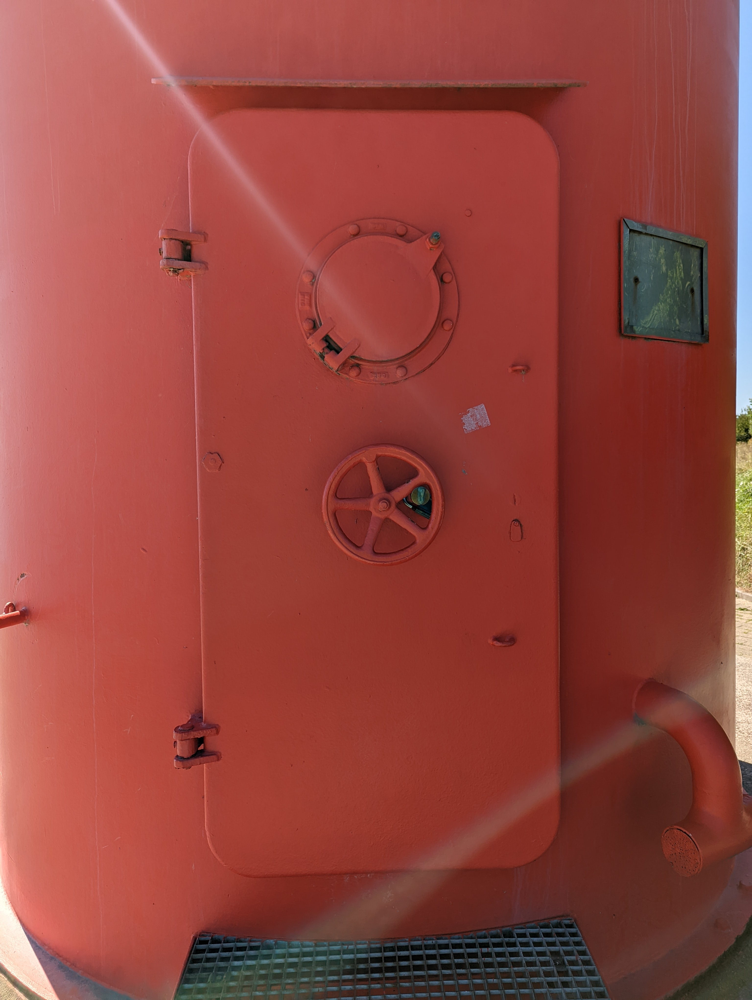

#osint
# Description
I found this suspicious door. I wonder what's behind it.

Can you find out where it is located?

**Download the image file** below and ignore the title image.

🚩 Flag

- name of the **city** this thing is standing on, wrapped in `he2024{ }`
- example: `he2024{Atlantis}`
reddoor.jpg


## Hint
inspect the file, not the photo
# Solution
If we need to inspect the file then there might be something on the EXIF data of the image.
Let's go once again to [CyberChef](https://cyberchef.org)

By using the *Extract EXIF* recipe the following information is obtained
```
Found 10 tags.

XResolution: 72
YResolution: 72
ResolutionUnit: 2
YCbCrPositioning: 1
GPSVersionID: 2,3,0,0
GPSLatitudeRef: N
GPSLatitude: 53.48147222222222
GPSLongitudeRef: E
GPSLongitude: 8.485480555555554
GPSAltitude: 50.4
```

Let's go to those GPS coordinates on Google maps


And this point is located in the city Nordenham, Germany. So the flag is `he2024{Nordenham}`
